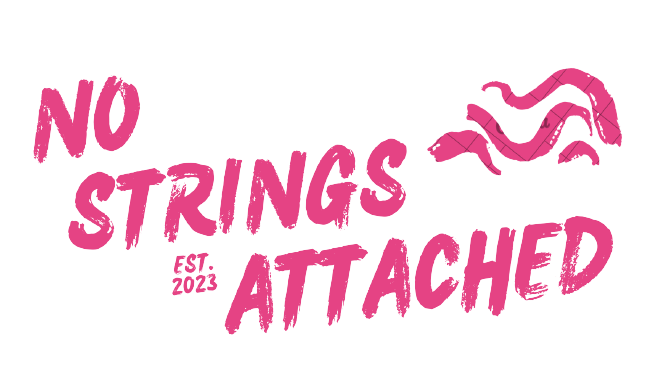

<div id="top"></div>

[![Issues][issues-shield]][issues-url]
[![MIT License][license-shield]][license-url]
[![LinkedIn][linkedin-shield]][linkedin-url]

<!-- PROJECT LOGO -->
<br />
<div align="center">
  <a href="https://github.com/joewhocodes/mo-strings-attached">
    
  </a>

<h3 align="center">No Strings Attached</h3>

  <p align="center">
    A Social Media app that connects you with other musicians in your area.
  </p>
    <br />
    <a href="https://github.com/joewhocodes/no-strings-attached"><strong>Explore the docs »</strong></a>
    <br />
    <br />
    <a href="https://nostringsattached.onrender.com">View Demo</a>
    ·
    <a href="https://github.com/joewhocodes/no-strings-attached/issues">Report Bug</a>
    ·
    <a href="https://github.com/joewhocodes/no-strings-attached/issues">Request Feature</a>
  </p>
</div>


<!-- TABLE OF CONTENTS -->
<details>
  <summary>Table of Contents</summary>
  <ol>
    <li>
      <a href="#about-the-project">About The Project</a>
      <ul>
        <li><a href="#built-with">Built With</a></li>
      </ul>
    </li>
    <li>
      <a href="#getting-started">Getting Started</a>
      <ul>
        <li><a href="#prerequisites">Prerequisites</a></li>
        <li><a href="#installation">Installation</a></li>
      </ul>
    </li>
    <li><a href="#usage">Usage</a></li>
    <li><a href="#license">License</a></li>
    <li><a href="#contact">Contact</a></li>
  </ol>
</details>


<!-- ABOUT THE PROJECT -->
## About The Project

[![Product Name Screen Shot][product-screenshot]](https://nostringsattached.onrender.com)


</p>
    <p align="center">
    This social media app is designed to connect you to local musicians in your area for casual jam sessions.
    <br>
    <br>
    Create an account with a profile picture. Then add a bio and some instruments you play.
    <br>
    <br>
    Filter all users by area and instrument played. Add some friends and leave them a message.
    </p>

<p align="right">(<a href="#top">back to top</a>)</p>

### Built With

* [MERN Stack](https://www.geeksforgeeks.org/mern-stack/)
* [MongoDB](https://www.mongodb.com)
* [Express.js](https://expressjs.com)
* [React.js](https://reactjs.org/)
* [Node.js](https://nodejs.org/en)
* [Redux](https://redux.js.org/)


<p align="right">(<a href="#top">back to top</a>)</p>


<!-- GETTING STARTED -->
## Getting Started

To get a local copy up and running follow these simple example steps.

### Prerequisites

* npm
  ```sh
  npm install npm@latest -g
  ```

### Installation

1. Clone the repo
   ```sh
   git clone https://github.com/joewhocodes/no-strings-attached.git
   ```
2. Install Server && Client NPM packages
   ```sh
   cd client && npm install && cd .. && npm install
   ```
3. Add Environment variables, including MongoDB, JWT and Cloudinary
   ```sh
  PORT = 
  MONGO_URI = 
  JWT_SECRET = 
  CLOUD_NAME = 
  API_KEY = 
  API_SECRET = 
   ```
4. Run the app
   ```
   npm run dev
   ```
<p align="right">(<a href="#top">back to top</a>)</p>


<!-- USAGE EXAMPLES -->
## Usage
<p>
Create an account with the Sign Up page. The app will add the user to MongoDB including a hashed password, and your image will be added to cloudinary with a reference in MongoDB.
<br>
<br>
Go to the profile page and add a bio and some instruments. 
<br>
<br>
Go to the All Users page and find some users close to you with the location filter. Use the instrument filter to find users that play the instruments your jam is missing! 
<br>
<br>
Add some friends, and leave them a comment.
</p>

<!-- _For more examples, please refer to the [Documentation](https://example.com)_ -->

<p align="right">(<a href="#top">back to top</a>)</p>


<!-- ROADMAP -->
<!-- ## Roadmap

- [ ] Feature 1
- [ ] Feature 2
- [ ] Feature 3
    - [ ] Nested Feature -->

See the [open issues](https://github.com/joewhocodes/no-strings-attached/issues) for a full list of proposed features (and known issues).

<p align="right">(<a href="#top">back to top</a>)</p>


<!-- CONTRIBUTING -->
## Contributing

Contributions are what make the open source community such an amazing place to learn, inspire, and create. Any contributions you make are **greatly appreciated**.

If you have a suggestion that would make this better, please fork the repo and create a pull request. You can also simply open an issue with the tag "enhancement".
Don't forget to give the project a star! Thanks again!

1. Fork the Project
2. Create your Feature Branch (`git checkout -b feature/AmazingFeature`)
3. Commit your Changes (`git commit -m 'Add some AmazingFeature'`)
4. Push to the Branch (`git push origin feature/AmazingFeature`)
5. Open a Pull Request

<p align="right">(<a href="#top">back to top</a>)</p>


<!-- LICENSE -->
## License

Distributed under the MIT License. See `LICENSE.txt` for more information.

<p align="right">(<a href="#top">back to top</a>)</p>


<!-- CONTACT -->
## Contact

Joe Ulyatt - [@joewhocodes](https://twitter.com/joewhocodes) - joewhocodes@gmail.com

Project Link: [https://github.com/joewhocodes/no-strings-attached](https://github.com/joewhocodes/no-strings-attached)

<p align="right">(<a href="#top">back to top</a>)</p>


<!-- MARKDOWN LINKS & IMAGES -->
<!-- https://www.markdownguide.org/basic-syntax/#reference-style-links -->
[contributors-shield]: https://img.shields.io/github/contributors/joewhocodes/no-strings-attached.svg?style=for-the-badge
[contributors-url]: https://github.com/joewhocodes/no-strings-attached/graphs/contributors
[forks-shield]: https://img.shields.io/github/forks/joewhocodes/no-strings-attached.svg?style=for-the-badge
[forks-url]: https://github.com/joewhocodes/no-strings-attached/network/members
[stars-shield]: https://img.shields.io/github/stars/joewhocodes/no-strings-attached.svg?style=for-the-badge
[stars-url]: https://github.com/joewhocodes/no-strings-attached/stargazers
[issues-shield]: https://img.shields.io/github/issues/joewhocodes/moviegojoe.svg?style=for-the-badge
[issues-url]: https://github.com/joewhocodes/moviegojoe/issues
[license-shield]: https://img.shields.io/github/license/joewhocodes/moviegojoe.svg?style=for-the-badge
[license-url]: https://github.com/joewhocodes/moviegojoe/blob/main/LICENSE.txt
[linkedin-shield]: https://img.shields.io/badge/-LinkedIn-black.svg?style=for-the-badge&logo=linkedin&colorB=555
[linkedin-url]: https://linkedin.com/in/joewhocodes
[product-screenshot]: /client/src/images/screenshot.png